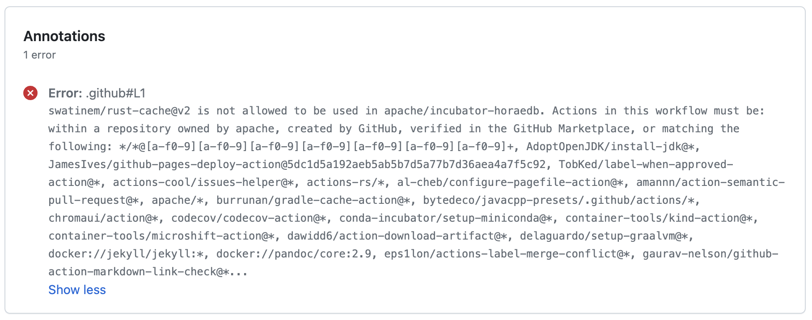

# For Mentors: Set up a new podling

For a new mentor, it's not quite clear how to set up a new podling after the incubation proposal gets accepted.

Although the Incubator documents contain a few pages talking about multiple aspects, it lacks a single-page step-by-step document. This page is for filling this gap.

Here is a diagram for the dependency graph: (TODO)

**Reference**

* [Mentors Guide](https://incubator.apache.org/guides/mentor.html)

## Add to the incubation summary file

Once the incubator proposal gets accepted, before doing anything else, you MUST add an entry for the new podling in the incubation summary file.

First, check out the Incubator trunk folder:

```shell
svn co https://svn.apache.org/repos/asf/incubator/public/trunk/
```

Then, edit `trunk/content/podlings.xml` file. Try to keep the podling tags alphabetic-sorted and add the information of new podling. For example,

```xml
<podling name="Fury" status="current" resource="fury" sponsor="Incubator" startdate="2023-12-15">
    <description>A blazing fast multi-language serialization framework powered by jit and zero-copy</description>
    <reporting group="3" monthly="true">January, February, March</reporting>
    <champion availid="tison">tison</champion>
    <mentors>
        <mentor username="tison">tison</mentor>
        <mentor username="fanningpj">PJ Fanning</mentor>
        <mentor username="liyu">Yu Li</mentor>
        <mentor username="xinwang">Xin Wang</mentor>
        <mentor username="eolivelli">Enrico Olivelli</mentor>
    </mentors>
</podling>
```

Note that the `reporting` tag MUST set attribute `monthly="true"` and value consisting a comma-separated list of the first three months. This means that the new podling SHOULD report monthly in the first three months.

The `group` attribute is based on the month in which the podling entered incubation:

* 1 for January, April, July, October
* 2 for February, May, August, November
* 3 for March, June, September, December

Finally, commit the updates:

```shell
svn ci -m "Add new podling <podling-name>"
```

Once the first three months passes, a mentor SHOULD update the `reporting` tag. For example,

```xml
<podling name="OpenDAL" status="current" resource="opendal" sponsor="Incubator" startdate="2023-02-27">
    <description>Open Data Access Layer: Access data freely, painlessly, and efficiently.</description>
    <reporting group="2" />
    <champion availid="tison">tison</champion>
    <mentors>
        <mentor username="tison">tison</mentor>
        <mentor username="ningjiang">Willem Ning Jiang</mentor>
        <mentor username="wusheng">Sheng Wu</mentor>
        <mentor username="tedliu">Ted Liu</mentor>
        <mentor username="hexiaoqiao">Xiaoqiao He</mentor>
    </mentors>
</podling>
```

### Bonus: Initialize the podling status page

This isn't required for setting up podlings, but you MUST finish it before the graduation. It's lightweight to finish alongside with updating the incubation summary file.

With https://svn.apache.org/repos/asf/incubator/public/trunk/ checked out:

```shell
cd trunk/content/projects
cp kvrocks.xml <podling-name>.xml
```

Modify the `<podling-name>.xml` file. You can refer to the `incubation-status-template.xml` file for an explained template.

Besides, you can create an extra podling YAML file that communicate with Whimsy. You MUST finish it before the graduation:

```shell
cd trunk/content/podlings
cp kvrocks.yml <podling-name>.yml
```

Modify the `<podling-name>.yml` file. It should be straightforward.

Finally, add the new files and commit them:

```shell
svn add trunk/content/projects/<podling-name>.xml
svn add trunk/content/podlings/<podling-name>.yml
svn ci -m "Add status page and whimsy metadata for new podling <podling-name>"
```

## Set up LDAP and DNS

Once the incubator proposal gets accepted and podling metadata updated in `podlings.xml`, you can file a ticket on [ASF INFRA](https://issues.apache.org/jira/browse/INFRA) to request setting up the LDAP and DNS for the new podling.

The LDAP group represents the Podling Project Management Committee (PPMC) and it is required for any privilege actions.

The DNS setup contains `podling-name.apache.org` and `podling-name.incubator.apache.org`. They host the same content by default.

Here are some examples:

* [Setup new Podling: answer](https://issues.apache.org/jira/browse/INFRA-25068)
* [Setup new Podling: fury](https://issues.apache.org/jira/browse/INFRA-25286)

## Self-serve resources

Once the LDAP group set up, you should be able to self-serve creating a few resources on https://selfserve.apache.org/.

You MUST [create a few mailing list](https://selfserve.apache.org/mailinglist-new.html), at least including:

* `private@<podling-name>.apache.org`
* `dev@<podling-name>.apache.org`
* `commits@<podling-name>.apache.org`

You SHOULD include the mentors in the moderator list for all the mailing lists created.

Most podlings [transfer their existing repositories](#transfer-repositories). But if you want to create a new Git repository, you can use https://selfserve.apache.org/git.html.

Most new podlings use GitHub Issues as their issue tracker. But if you want to create a new Jira project for tracking issues, you can use https://selfserve.apache.org/jira-project.html.

Most new podlings host Wikis on GitHub or [project website](#bonus-set-up-project-website). But if you want to create a new Confluence Wiki space, you can use https://selfserve.apache.org/confluence-new.html.

## Submit CLA and SGA

Before add the initial committers to the LDAP group, they MUST submit an [Individual Contributor License Agreement (ICLA)](https://www.apache.org/licenses/icla.pdf).

Before transfer the repositories from the original organization to the ASF, the corporate MUST sign a [Corporate Contributor License Agreement (CCLA)](https://www.apache.org/licenses/cla-corporate.pdf) and [Software Grant Agreement (SGA)](https://www.apache.org/licenses/software-grant-template.pdf).

You may sign documents by hand or by electronic signature, and submit them by email. When submitting by email, please fill in the form with a PDF viewer, then print and sign it, scan all pages into a single PDF file, and attach the PDF file to an email addressed to [secretary@apache.org](mailto:secretary@apache.org).

If possible, send the attachment from the email address you list in the document. Send only one attached document per email.

You can find full documents at [ASF CONTRIBUTOR AGREEMENTS](https://www.apache.org/licenses/contributor-agreements.html) and [ASF CLA FAQ](https://www.apache.org/licenses/cla-faq.html). Here are the most frequent questions:

:::info Who should sign the CCLA and SGA?

Generally, who makes the decision of the donation. It's typically a manager, a director, the CTO, or the CEO.

:::

:::info How can I sign the document by electronic signature?

The ASF provides [instructions](https://www.apache.org/licenses/cla-faq.html#printer) on macOS, iOS, and Android.

:::

**Reference**

* [ASF CONTRIBUTOR AGREEMENTS](https://www.apache.org/licenses/contributor-agreements.html)
* [ASF CLA FAQ](https://www.apache.org/licenses/cla-faq.html)

## Transfer repositories

Once the LDAP group set up and SGA got accepted, you can file a ticket on [ASF INFRA](https://issues.apache.org/jira/browse/INFRA) to request transferring repositories.

Here are some examples:

* [Transfer GitHub repositories for HoraeDB](https://issues.apache.org/jira/browse/INFRA-25287)
* [Transfer GitHub repositories for Fury](https://issues.apache.org/jira/browse/INFRA-25304)

You SHOULD grant admin permission of the repos to the assigned ASF INFRA team member. Alternatively, you can move the repos to an intermediate org and grant permissions, if the original org is under strictly control.

Once repos transferred, the initial committers and mentors would have only the write permission, which means you cannot modify repo settings. Although it's possible to modify indirectly by filing ASF INFRA tickets or updating the [.asf.yaml](https://cwiki.apache.org/confluence/display/INFRA/git+-+.asf.yaml+features) file, you'd better check the settings before transferring:

* Move or duplicate dependent org-level secrets to repo-level.
* Check and release branch protection rules if necessary; note that you would have only the write permission and not be an admin anymore after repo transferred.
* Remove redundant GitHub Apps and other integrations required admin permissions, especially the [CLA assistant](https://cla-assistant.io/).

You may list all the GitHub Actions used in the CI workflows. See the [Whitelist GitHub Actions](#bonus-whitelist-github-actions) section for more information.

**Reference**

* [.asf.yaml features](https://cwiki.apache.org/confluence/display/INFRA/Git+-+.asf.yaml+features)

### Bonus: Whitelist GitHub Actions

You MAY use all actions internal to the `apache/*,` `github/*` and `actions/*` namespaces without restrictions. Other GitHub Actions SHOULD be added to the whitelist explicitly.

During the past years, a few actions are added to the org-level whitelist, like `korandoru/hawkeye@*` and `peaceiris/actions-gh-pages@v3`. But you may still find errors containing "xxx-action is not allowed to be used in apache" in CI workflows like:



You can file a ticket on [ASF INFRA](https://issues.apache.org/jira/browse/INFRA) to request whitelist a certain GitHub Actions in your repository.

Here are some examples:

* [Whitelist GitHub Actions azure/setup-helm](https://issues.apache.org/jira/browse/INFRA-23716)
* [Whitelist GitHub Actions arduino/setup-protoc for OpenDAL](https://issues.apache.org/jira/browse/INFRA-24928)
* [Whitelist swatinem/rust-cache@v2 for HoraeDB repos](https://issues.apache.org/jira/browse/INFRA-25315)

**Reference**

* [GitHub Actions Policy](https://infra.apache.org/github-actions-policy.html)
* [GitHub Actions and Secrets](https://infra.apache.org/github-actions-secrets.html)

## Add initial committers

Once the LDAP group set up and any ICLA of an initial committer got accepted, a mentor or a PPMC member can add that initial committers to the PPMC.

You should be able to log in [the Whimsy dashboard](https://whimsy.apache.org/roster/ppmc/) with your Apache account, find the podling and click "Add" in the podling dashboard:

````mdx-code-block
import WhimsyAddNewMember from './whimsy-add-new-member.png';


````

Search initial committers by their Apache ID, tick "Has the NOTICE email been received by the Incubator list?" and then click "Add to PPMC".

:::caution

The NOTICE email MUST be sent for any following PPMC member, but the vote result of the incubation proposal can be used for initial committers regarded as such an email here.

:::

**Reference**

* [Voting in a new PPMC member](https://incubator.apache.org/guides/ppmc.html#voting_in_a_new_ppmc_member)

### Bonus: Request an account

If the ICLA of an initial committer got accepted, but he/she forgot to request an Apache account, any Apache Member can request an account for the committer self-serve on: https://whimsy.apache.org/officers/acreq

## Bonus: Set up project website

See also [Set up project website](setup-project-website.md).

## Bonus: Set up Nexus repository group

If the new podling wants to release Maven artifacts under `org.apache.<project-name>`, you SHOULD file a ticket on [ASF INFRA](https://issues.apache.org/jira/browse/INFRA) to request setting up the Nexus repository group.

Here is an example:

* [Add org.apache.horaedb groupId](https://issues.apache.org/jira/browse/INFRA-25344)

ASF INFRA can set up GitHub secrets and Nexus configs for running automatic releases. Please refer to:

* [Automatically deploy to snapshot repo](https://issues.apache.org/jira/browse/INFRA-24709)
* [Automatically deploy to release repo](https://issues.apache.org/jira/browse/INFRA-24880) ([follow-up](https://issues.apache.org/jira/browse/INFRA-24996))

**Reference**

* [Apache Maven repositories](https://infra.apache.org/repository-faq.html)
* [Publishing Maven Releases to Maven Central Repository](https://infra.apache.org/publishing-maven-artifacts.html)
