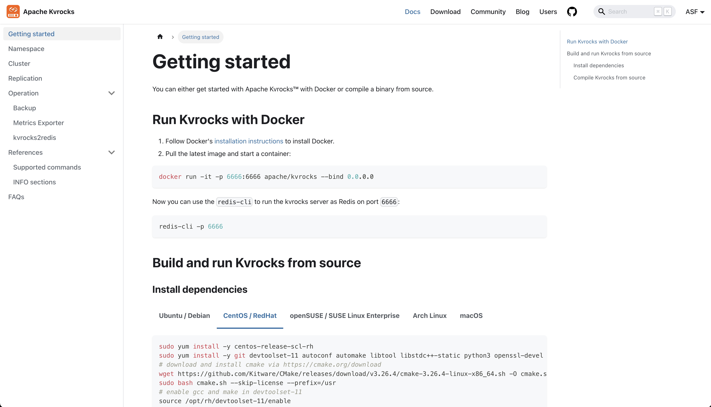

# A Recap of Apache Kvrocks™ becoming TLP

[Apache Kvrocks](https://kvrocks.apache.org/) is a distributed key value NoSQL database that uses RocksDB as storage engine and is compatible with Redis protocol. It aims to address the high memory cost and limited capacity issues of Redis. You can use Kvrocks as a drop-in replacement as a persistent variant of Redis.

Kvrocks was initially developed internally by [Meitu Inc.](https://www.meitu.com/) and was open-sourced and developed independently in 2019. In April 2022, Kvrocks entered the ASF Incubator with Chen Liang as the Champion.

During the one-year incubation period, the number of contributors and users more than doubled, and four different release managers successfully completed the release of four official versions that complied with the [Apache release standards](https://www.apache.org/legal/release-policy.html). In April 2023, Apache Kvrocks initiated the graduation process and discussions, ultimately completing the process and [officially graduating in June 2023](https://news.apache.org/foundation/entry/the-apache-software-foundation-announces-new-top-level-project-apache-kvrocks).

In early 2022, I was nominated as an official member of the ASF by Willem Ning Jiang. Then I became qualified as a mentor to participate in mentoring projects. At that time, I happened to come across [the incubation proposal for Kvrocks](https://lists.apache.org/thread/bdtmvbmvzrgjd1kj7mdrp9tkqrhg3d31) and after reading it, I believed it was a promising project, so I volunteered to become one of the mentors.

Apache Kvrocks is the first incubator project (podling) that I mentored to graduate successfully. During the incubation period, I put my open-source philosophy into practice, helping the project maintainers understand the principles of [The Apache Way](https://www.apache.org/theapacheway/), and also participating in the development and growth of the project. It can be said that Kvrocks has helped me validate many ideas about producing open-source software and community development.

This article will start from the incubation process and my involvement, introducing the community status, achievements, and future directions of Apache Kvrocks.

<!-- truncated -->

## The bar to open-source participation

ASF Incubator's PMC (IPMC) Chair, Justin Mclean, has mentioned that the community model of ASF, where everyone is a volunteer, makes it inappropriate to require developers to implement significant features or participate long-term before granting them committer privileges. This is because many developers do not engage in open-source software development on a full-time basis. By assuming trust in the community, granting committer privileges to contributors can encourage them to make more significant contributions.

I deeply understand these two points. Often, I find that I'm more motivated to dedicate time and make more contributions to a project only after becoming a committer. This is mainly because, before becoming a committer, submitting code and driving issue resolution always relied on another committer to actually execute them. Although the ASF committer invitation template mentions that not becoming a committer does not hinder developer participation and contribution, there is indeed an efficiency gap.

The first committer of Kvrocks after entering incubation, [@PragmaTwice](https://github.com/pragmatwice) (Twice), is an example of this. He is now the second-ranked contributor on [the Contributor Leaderboard](https://github.com/apache/kvrocks/graphs/contributors), second only to the project's author, who has been submitting code since day one.

I believe that if he did not have commit access, many tasks would simply not be done because they would become "cumbersome". Even after Twice completing the initial refactoring of the CMake build, without proper recognition or what can be called a "push", the connection between him and this project might have ended there.

The timely recognition of developer contributions also plays a role in other Kvrocks committers.

However, there are two issues when trying to generalize this practice.

The first issue is that a lower bar is not always better.

Although there was a practice in the early stages of Perl 6 to grant commit access to any participant to encourage their involvement, later on, Perl 6 changed this strategy, and its core interpreter and virtual machine projects have always maintained a certain level of commit access requirements.

I previously wrote a Chinese article titled [_Maintainers Criteria_](https://www.tisonkun.org/2022/09/12/maintainer-criterions/) discussing the standards for nominating new committers and maintainers in open-source communities. In a recent discussion among ASF Members, I ultimately simplified it to the following paragraph:

> For the committer bar, I always think of whether the candidate is easy to work with - make decisions with cautious while bravely, know when to ask for help.
>
> For too much new committers, it hurts when their contributions always need to revision especially trivial mistakes. If we elect a new committer while his/her contribution need more attention to avoid merged wrongly quickly, we lose the reason to invite the very person.
>
> Apache doesn't set up fine-grained permissions, so it’s extremely important not to approve something you're unsure with.

This is also the standard I use when selecting new individuals as Maintainers. In short, it can be summarized as "making decisions bravely, knowing when to seek help, and exercising caution in confirmation."

The second issue is that Justin Mclean's opinion is based on the community model of ASF, where all participants are volunteers.

This low barrier strategy may not necessarily apply to enterprise-driven open-source communities. Since it is unrelated to the Kvrocks community's situation, I won't elaborate further. However, it is worth noting that in China, when promoting open-source, there is a tendency to equate ASF or Linux with the entirety of open-source, while overlooking their history, positioning, and assumptions. This has led to some companies making erroneous judgments when formulating open-source strategies, and I would like to provide this reminder.

## Software Productivity and Experience

In my Chinese article [_Why do Chinese open-source communities always have a strange style of operation?_](https://www.tisonkun.org/2023/06/04/oss-community-in-china/) I mentioned at the end that the foundation of a successful open-source community lies in the product strength of the open-source software. During the incubation period of Kvrocks, the following tasks were completed for both users and developers.

### The official website

Website: https://kvrocks.apache.org/docs/getting-started

Although GitHub's automatic rendering of README can somehow be served as project portals, it is still preferable for a software to have a well-established official website. Thanks to the [Docusaurus](https://docusaurus.io/) framework, which was open-sourced by Facebook, it is now relatively easy for an open-source project to quickly build a technical-looking official website.

Apart from the modifications made by a frontend designer on the homepage, the documentation was migrated and translated from the original wikis. Other pages, such as the blog page, community page, search functionality, Committer Guide, and user logo wall, were mainly developed by myself and the project author, [@git-hulk](https://github.com/git-hulk).

Initially, these contents were based on the design of another project I was involved in, [Apache InLong](https://inlong.apache.org/). Later, they were also references by two other projects I mentored, [Apache StreamPark](https://streampark.apache.org/) and [Apache OpenDAL](https://opendal.apache.org/). This demonstrates the open-source spirit of inheritance and reuse.

Currently, there is still potential improvement in the style and design of the homepage. What elements should be presented on the page are also open to discussion. If you are a visual designer or a product manager with experience in NoSQL, you are welcome to initiate a discussion to help Kvrocks create a better homepage.

### Build system and code refactor

Initially, Kvrocks was built with Makefile, and RocksDB was integrated as a Git submodule. The build depended on shell scripts, which included various assumptions. Although there was a semi-functional CMake build system, it was yet to complete.

I am aware that if developers encountered build failures right from the start, they would not have the motivation to address the issues and might simply conclude that the software was not good enough, leading them to abandon it. In fact, this was my very first experience with Kvrocks before becoming a mentor. So, I attempted to improve the CMake build integration and wrote a Chinese article [_How CMake Works?_](https://www.tisonkun.org/2022/04/15/how-cmake-works/) to share my experience.

Coincidentally, at that time, Twice was also working on similar tasks and [responded to my article](https://github.com/tisonkun/blog/discussions/16#discussioncomment-2573397). I invited him to help review the patches I made for modifying the CMake build system in Kvrocks. During our communication, I sensed his insights into the problem and suggested that he directly take over the rest task. I promised to review his code.

Twice then started working on improving the CMake build system and gradually became involved in Kvrocks development. When I saw Twice actively responding to issues encountered by other developers who used his modified build system, I considered him a qualified candidate for a committer: someone who took responsibility for their own code, which is rare.

Later on, focusing on the build and development experience, I replaced the build scripts from shell to Python and the test cases from TCL to Golang. This greatly improved the code maintainability and stabilized many integration tests that were previously unstable due to poor debugging capabilities.

At the same time, using Golang for integration testing involved referencing the upstream [go-redis](https://github.com/redis/go-redis) library (initially, I happily used it because the library's README mentioned its compatibility with Kvrocks).

During the process, I had communicated a lot with the upstream maintainer, [@vmihailenco](https://github.com/vmihailenco). Both projects benefited from this integration by enhancing their product quality. It is worth mentioning that @vmihailenco later wrote a [blog post](https://kvrocks.apache.org/blog/go-redis-kvrocks-opentelemetry) for Kvrocks, sharing how their product can use Apache Kvrocks as a drop-in replacement for Redis, providing a well-documented and validated compatibility test suite.

Twice's improvements to the development experience mainly focused on integrating various C++ toolchains and refactoring the command parse and execute framework, which had the most leverage effect.

Regarding the former, by integrating formatting tools, linter tools, and various memory/thread testing tools, Kvrocks made significant improvements in code consistency and avoiding common programming errors.

As for the latter, the recent rapid alignment of Kvrocks with Redis commands benefited from the preliminary work done during these refactorings:

* [Tracking issue: Support RESP3 in Kvrocks](https://github.com/apache/kvrocks/issues/1980)
* [Tracking Issue: Towards a more redis-compatible database](https://github.com/apache/kvrocks/issues/1942)
* [Tracking issues: add the support of all missing commands in the list type](https://github.com/apache/kvrocks/issues/1512)

In addition to these contributions, Twice, with his extensive C++ experience, overall elevated the quality level of the Kvrocks codebase.

## Deploy Kvrocks

As we all know, Redis is a single-node, in-memory key-value database. Kvrocks, on the other hand, claims to be a distributed key-value database. Its main distinction is that it implements a complete clustering solution and provides compatibility with the Redis Cluster API.

Once we involve the deployment and operation of a cluster, the complexity increases exponentially compared to a single-node system. To address this, the developers of Kvrocks have recently been incubating two operational deployment tools: [Kvrocks Operator](https://github.com/RocksLabs/kvrocks-operator) and [Kvrocks Controller](https://github.com/apache/kvrocks-controller). In the future, these tools are expected to be pushed upstream under the Apache namespace. There are opportunities for early testing and participation in the development, and we welcome anyone interested to join.

## Naming Kvrocks

This is not a solved problem but rather an anecdote. For Chinese developers and those familiar with the background, the name "Kvrocks" is easily understood: a KV database based on RocksDB. However, due to the case sensitivity, it is unclear how to pronounce "Kvrocks" for native speakers.

The importance of a name can be seen from the example of Toyota, which was changed from the Japanese Romanized Spelling "Toyoda" to a more suitable English pronunciation.

Apart from its impact on dissemination, for heavily involved participants, the name is something they are facing every day. A name that is fluent, easy to understand, and avoids various sensitive areas can minimize the strange perceptions that developers and users may have. At the very least, it should not become an obstacle to their pride in the project.

## Sustainability of open-source projects

Finally, let's discuss the issue of sustainability in open-source projects.

The ASF Incubator develops a maturity model, and before graduating, Kvrocks followed this model to [make an assessment](https://github.com/apache/kvrocks-website/blob/9a83547f40455ccfcddc6f23fca501d9e4305b0c/maturity.md). I have also provided some annotations in another [Chinese blog](https://mp.weixin.qq.com/s/5eOcS261iDghYxxjl5-ICw). In general, ASF evaluates sustainability based on the diversity of users, developers, and maintainers.

Even before entering the incubator, project maintainers and mentors need to collaborate on a proposal that includes a review of the project community's sustainability. Some aspects considered are:

* Orphaned Products
* Inexperience with Open Source
* Homogenous Developers
* Reliance on Salaried Developers

In addition to the diversity of community members, achieving diversity itself should address the question of why community members participate. I have proposed a way to think about this in "Creating Value Together", but the answers can be abstract. Taking Kvrocks as an example, we can see some specific examples.

I personally went through the entire process of guiding the development of an open-source project through mentorship and involvement in the Kvrocks project. I also experimented with all the ideas mentioned above from a technical perspective. For corporate projects, implementing these ideas faced numerous obstacles that went beyond technical issues. For personal small projects, it's difficult to assess the effectiveness of the experiments since the number of participants is not large, and many problems do not exist at such level (in most cases, it only requires an active project author).

However, the experience of guiding open-source projects has given me the confidence to champion more incubation projects and provide advice for more projects. I have experienced many cases and scenarios, knowing what to expect and how to respond.

The project author, @git-hulk, drove the project to enter and graduate from the ASF Incubator. Today, he serves as the PMC chair for Apache Kvrocks, a top-level ASF project. This achievement does not only benefit his personal resume but also is a source of great accomplishment for a project author to have their software recognized and used globally.

Both Twice and another committer, @tanruixiang, became Kvrocks committers while they were still students. I believe that if they continue to develop in the software industry, this experience will be invaluable. At the same time, it is a realization of the vision that many open-source evangelists present to students: making non-trivial changes to software used by many people and having your code running in critical scenarios for certain organizations.

:::note

@tanruixiang is now acting as an active initial committer for another podling, [Apache HoraeDB](https://horaedb.apache.org/). He uses his experiences in Kvrocks to help other initial committers adopt ASF culture and policies.

:::

Other contributors, such as @ShooterIT and @ColinChamber, who were already committers before incubation, and @xiaobiaozhao and @torwig, who became committers after incubation, are all members of teams that use Kvrocks in production environments. Participating upstream and making Kvrocks better is the optimal "upstream first" strategy without the need for hard forks.

Of course, in addition to committers, there are users who provide feedback and developers who submit patches or review code. They have their own motivations and contribute value within the community. Overall, the sustainability of Kvrocks relies on the success of its community.

Lastly, I want to emphasize that this discussion is specific to ASF projects, and there is no "commercial company behind" or any vendor involvement. For situations involving enterprises initiating or participating in open source, you can read my other Chinese articles, such as [_Practical Software Licensing Models for Commercial Open Source Software_](https://www.tisonkun.org/2023/02/15/business-source-license/) and [_Open Source is not a Business Model_](https://www.tisonkun.org/2023/03/30/open-source-is-not-business-model/).
