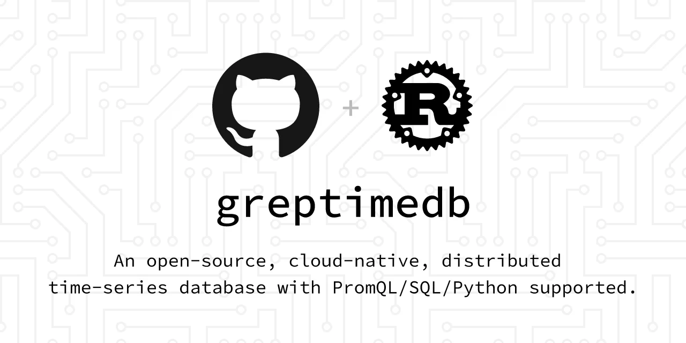
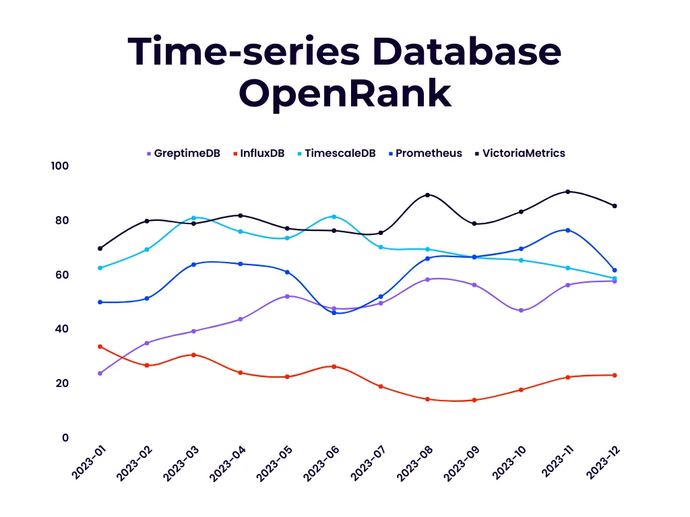
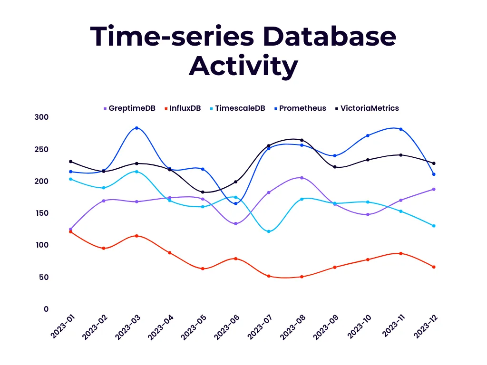
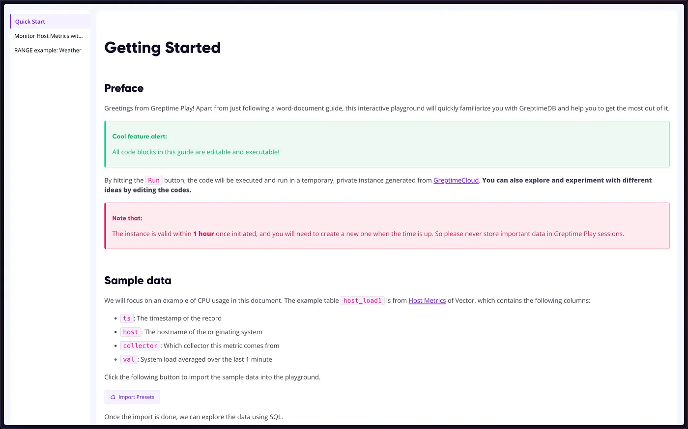
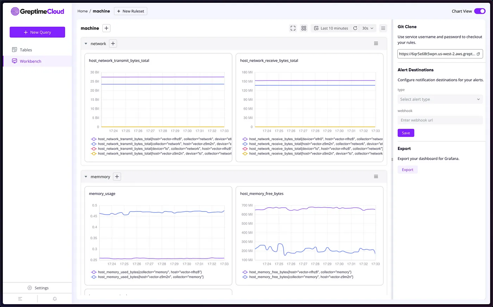
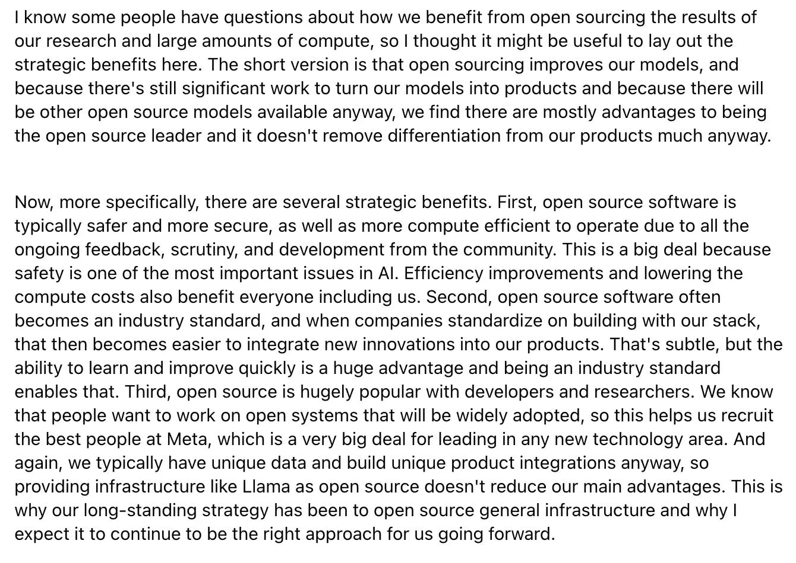

# GreptimeDB Community Report

GreptimeDB is an open-source time-series database (TSDB) developed by Greptime Inc. Its source code is [publicly available on GitHub](https://github.com/GreptimeTeam/greptimedb?tab=readme-ov-file):

<!-- truncate -->

I first came across the GreptimeDB project in 2022. In 2023, I noticed that its [Community Program](https://github.com/greptimeteam/community) was well thought out, not blindly copying rules from so-called successful projects. This invoked my interest in open-source governance and community operations, prompting discussions with its members. After delving into GreptimeDB’s source code, I was impressed by their remarkable engineering capabilities, so I [started contributing](https://github.com/GreptimeTeam/greptimedb/issues?q=author%3Atisonkun+sort%3Acreated-asc).

After several months of involvement, I have gained a preliminary understanding of the GreptimeDB community. I believe that this is an open-source community with significant potential worth participating in. Therefore, I am writing this community report to provide a brief introduction and share my thoughts.

:::info DISCLAIMER

During my participation in the community, I have had in-depth discussions with core members of the GreptimeDB community. Recently, I’ve taken a step further by joining the Greptime team. As such, my observations and assessments may carry a degree of subjectivity. Welcome to leave comments for further discussion.

:::

<!-- truncate -->

## Quantitative Analysis

Two years ago, someone jokingly remarked that Rust and TSDB were becoming open-source memes. GreptimeDB is one such project, which is also written in Rust.

However, after two years, GreptimeDB stands out as one of the few remaining projects that have persevered and continued to grow. Even when compared to mainstream TSDB projects, GreptimeDB’s vitality is noteworthy.

The above two images show the monthly OpenRank and activity index data generated from the OpenDigger dataset in 2023, which marks [the first year of GreptimeDB’s open-source operation](https://greptime.com/blogs/2024-01-08-2023-greptime-journey).

From the perspective of OpenRank, GreptimeDB has significantly outperformed InfluxDB in recent years and is on par with TimescaleDB and Prometheus. However, there is still a gap compared to the commercially open-sourced product VictoriaMetrics. Regarding the project activity, GreptimeDB belongs to the top tier alongside mainstream projects other than InfluxDB.

:::note OpenRank

[OpenRank](https://github.com/X-lab2017/open-digger?tab=readme-ov-file) is an open-source value flow analysis metric defined by Dr. Frank Zhao of Tongji University.

Unlike metrics such as star counts or DB Engines rankings, which can be significantly impacted by first-mover advantages, the monthly OpenRank and activity changes displayed above offer a more accurate representation of the project’s ongoing development and future trends.

:::

## Community Development

As mentioned earlier, my genuine interest in the GreptimeDB community began when I discovered their Community Program was not just a cargo-cult movement but well-thought-out and feasible. The results have proven this to be true. In 2023, GreptimeDB, following the design of the Community Program, welcomed two new committers apart from the company:

* [Biweekly Report (Jun.5 — Jun.18) — A Key Milestone, First External Committer Onboard](https://greptime.com/blogs/2023-06-21-biweekly-report)
* [Biweekly Report (Jul.17 — Jul.30) — Welcome the Second External Committer](https://greptime.com/blogs/2023-08-02-biweekly-report)

Both committers were nominated due to their substantial code contributions, with each submitting around twenty patches that were acknowledged for their quality by the project team. Furthermore, these committers had been actively involved in the project for several months before becoming committers. It is evident that these two committers, selected and recognized based on this standard, remained actively engaged in the project last month.

The functionality of GreptimeDB has taken shape, meeting the standards for the production environment. This also signifies that the extensive groundwork of the pioneering phase has been completed, allowing new community members to leverage their creativity on a solid engineering foundation. Nevertheless, GreptimeDB still offers considerable opportunities for optimization. There are numerous unresolved issues related to design and implementation in technical domains, including inverted indexes, Write-Ahead Logs (WAL), and storage engines. This period presents a valuable chance for individuals to engage with GreptimeDB and potentially become committers.

However, there are still areas within GreptimeDB’s Community Program that can be improved before it can be considered a benchmark for commercial open-source projects.

For example, promoting new Committers is only briefly mentioned in biweekly reports. The Community Program does not immediately reflect its smooth operation or the fact that there are Committers outside the company in the community. There is also a lack of introductions and sharing of successful stories for active contributors and Committers. Currently, the community essentially operates at a basic level of granting permissions to those who write good code.

Furthermore, although the Community Program has been streamlined compared to other cargo-cult movements to ensure practical operation, there are still some organizational gaps. For example, the Steering Committee, designed to make technical and community development decisions, primarily involves company team discussions and decisions later made publicly. Additionally, while SIGs and even the OSPO have been defined within the Community Program, there is a lack of manpower to operate these structures.

I advocate for the ongoing revision of the Community Program, taking into account the community’s present operational state along with the envisioned and attainable future state.

1. Increasing transparency in the criteria and pathways to becoming a Committer and inviting Committers to tell their stories.
2. Streamlining redundant and fictitious organizational structures while retaining key actions such as listening to community inputs and making decisions public to the community.
3. Emphasizing the diversity of channels through which community members can participate, encouraging them to help others use GreptimeDB and contribute through various channels. This is significant for being an Ambassador/Advocate.

Apart from this pioneering exploration work within the Community Program, two stories of the GreptimeDB community have left a lasting impression on me.

The first is the active participation of the GreptimeDB community in practical open-source activities like the Open Source Promotion Plan. The three challenge projects released in 2023 have all achieved commendable results in fostering mentorship and knowledge transfer within the open-source community.

* [Discover How Students Are Transforming GreptimeDB](https://greptime.com/blogs/2023-12-07-ospp-greptime)
* [From Participant to Intern — Zou Wei’s Journey with Greptime and OSPP 2023](https://greptime.com/blogs/2023-09-13-intern-zouwei)

The second is the extremely fast turnover rate of good-first-time issues within GreptimeDB, where most beginner-friendly tasks are typically claimed within a week, often in just two to three days, with satisfactory completion rates. During the claiming and implementation process, as long as you proactively update progress and ask questions, most project team members respond promptly. Such an experience is truly commendable.

## Engagement

When introducing GreptimeDB, I used a few buzzwords, such as open-source, written-by-Rust, distributed system, cloud-native, and time-series databases. While these descriptions touch on some of GreptimeDB’s capabilities and features, from the perspective of a pragmatic programmer, we should pursue a more comprehensive exploration.

Even though quite a few TSDBs were already in the market, GreptimeDB authors identified issues that existing solutions failed to address. For the three essential categories of time-series data: metrics, events, and logs, most TSDBs can only optimize storage and access for one or two of these types.

GreptimeDB authors believe these three categories of data can share the same query engine and object storage layer, only requiring the implementation of storage engines tailored to each data category’s characteristics. Most of the architecture and capabilities of databases, such as data sharding, distributed scheduling, querying, indexing, and compression, can be shared. In this way, GreptimeDB can ultimately become a single system that optimizes storage and access for all types of time-series data.

:::note

Apache SkyWalking has developed its own database, BanyanDB, grounded in similar challenges and considerations. However, as a subproject of a monitoring project, it is more specialized in its implementation. This reflects the industry consensus that time-series data can be uniformly stored, and all mainstream products will evolve in this direction.

:::

Apart from the shining future we’re chasing, GreptimeDB also faces practical challenges.

### Engineering and Performance

While I hold GreptimeDB’s engineering in high regard, particularly how contributors can identify orthogonal aspects for feature development or refactoring, it’s important to recognize that software engineering remains a discipline where, despite a thorough understanding of principles and best practices, the actual implementation demands a significant amount of effort.

During rapid development iterations, GreptimeDB’s memory usage is rough and abstractions are casual. As more and more applications are built upon GreptimeDB, the team receives various performance issues reported by users.

This necessitates a focus on details overlooked during rapid development, meticulously scrutinizing memory usage on critical paths, and making targeted performance optimizations to fully utilize machine resources. There are plenty of optimization opportunities like these for GreptimeDB at the moment.

### Indexes and Optimizer

The reason why existing TSDBs struggle to serve all three mentioned categories of time-series data effectively is that, following a substantial increase in data volume, the read and write performance for certain types of data deteriorates significantly.

To tackle these challenges, the industry has proposed a range of index schemas. Currently, GreptimeDB is in the process of implementing the inverted indexes solution:

[Tracking issue for introducing inverted index](https://github.com/GreptimeTeam/greptimedb/issues/2705)

We’ll explore solutions combining inverted indexes, cost-based query optimizers, and MPP query engines. There are many opportunities for participation in this work, and many GreptimeDB team members are already investing significant effort in this area.

### Write-Ahead Logging

Moreover, the trade-off between data consistency and performance relies on the implementation of Write-Ahead Logging (WAL).

Currently, GreptimeDB only offers a local implementation based on RaftEngine and a remote implementation based on Kafka. The implementation of remote Kafka is less than three months old.

Following up on this now to participate in the refinement and optimization of existing implementations, as well as potentially design and implement a custom WAL process, will be a valuable experience for any data infrastructure developer.

You can search “WAL” or “Kafka” on the Issue page to find outstanding entry points.

### Analytics and Dataflow

Furthermore, GreptimeDB supports homogeneous deployments on the cloud and at the edge, where time-series data is processed using the same technology stack. If GreptimeDB could support advanced analytical capabilities, the cost of time-series data analysis would significantly decrease, thus enhancing the overall experience.

Currently, GreptimeDB already facilitates analysis via SQL, PromQL, and Python scripts. And we’re designing and implementing real-time analytics based on Dataflow technology, naming GreptimeFlow:

[Tracking issue for dataflow framework](https://github.com/GreptimeTeam/greptimedb/issues/3187)

The demand for analysis is endless, making this a great starting point for developers familiar with data analysis.

### Ecosystem

Besides the codebase of the main repo, GreptimeDB has also open-sourced a comprehensive dashboard solution and multi-language clients.

[GreptimeDB Dashboard](https://github.com/GreptimeTeam/dashboard)

Since GreptimeDB is already compatible with industry-standard interfaces like SQL and PromQL, integrating with the GreptimeDB ecosystem is a promising path for involvement in GreptimeDB’s development.

Just a few weeks ago, I saw a developer using both EMQX and GreptimeDB submitting patches to GreptimeDB’s Erlang ingester.

Beyond software development participation, you can also join us through the following two crucial channels we maintained:

* [GitHub Discussions for topic discussions](https://github.com/orgs/GreptimeTeam/discussions)
* [Slack Workspace for instant messaging](https://www.greptime.com/slack)

Welcome to join the channel and drop a message!

## Sustainability

I have expressed a viewpoint: “Commercialization is NOT necessary for the sustainability of open-source projects.”

Many open-source software projects are driven by the interests of individual developers, who may have other sources of income. These individual developers can maintain and develop these projects without making money directly from the software they create.

However, GreptimeDB is an open-source software developed by Greptime Inc., and for the company to sustain itself, the company must generate profits in some way. Greptime Inc. has invested a significant amount of capital and manpower in the development of GreptimeDB, so GreptimeDB should contribute to Greptime’s commercial success at some points.

Currently, Greptime Inc. provides two commercial products:

* [GreptimeCloud](https://greptime.com/product/cloud) provides fully managed cloud-native time-series database services, with the core being GreptimeDB. This service is [free to start](https://console.greptime.cloud/), and its [Playground](https://www.greptime.com/playground) and Dashboard are tastefully designed.

<figure>

<figcaption>GreptimeCloud Playground: An Interactive Notebook to Getting Started</figcaption>
</figure>

<figure>

<figcaption>GreptimeCloud Dashboard: Your Monitor Cockpit</figcaption>
</figure>

* [GreptimeAI](https://greptime.com/product/ai) offers observability functions for LLM applications. Unlike other LLM-powered database products, GreptimeAI is for LLM applications. The current wave of LLM has limited impact on improving database services themselves; instead, these LLM applications generate data that needs to be stored and managed by databases.

The open-source GreptimeDB provides the underlying capabilities of these two products, while features such as the control panel, team management, and security are implemented in commercial code.

Regarding the decision to make the core GreptimeDB database open-source instead of keeping it as entirely proprietary commercial software, the reasons outlined in Llama’s open-source announcement within Meta’s financial report a few weeks ago spare me from extensive elaboration:

<figure>

<figcaption>Why Llama must be “open-source”</figcaption>
</figure>

In the case of GreptimeDB, when the Greptime team decided to develop this product, the mainstream time-series databases had already gained significant first-mover advantages, and they were mostly open-source.

In this scenario, even though GreptimeDB had the advantage of starting fresh without historical burdens and heading in the right direction, the inherent complexity of software engineering and necessary efforts cannot be infinitely reduced. Therefore, open source is an essential move to catch up with existing mainstream products and win user trust.

Of course, open-source software allows any user to use it for free, so building commercial value cannot be directly based on the open-source software itself. Otherwise, the company would switch the OSS product to a commercial license at the end; it would be a disaster.

Regarding how Greptime Inc. designs its open-source model, perhaps I will write other articles for a comparative introduction. Currently, its open-source model is similar to that of Databricks. Although GreptimeDB was built from scratch, unlike Databricks, which directly constructs solutions based on Apache Spark, GreptimeDB’s core functionality heavily reuses existing open-source software:

* Apache Arrow DataFusion
* Apache OpenDAL
* TiKV RaftEngine
* Apache Kafka
* ...

Moreover, the Greptime team deliberates over which features to open-source instead of defaulting to making everything open-source. Such careful consideration allows strategic open-sourcing to be pursued for commercial sustainability.

## Conclusion

This article describes GreptimeDB's shining future and how you can engage the community now. It also shows how the Greptime team achieves sustainability for both its finance goal and running GreptimeDB open-source.
